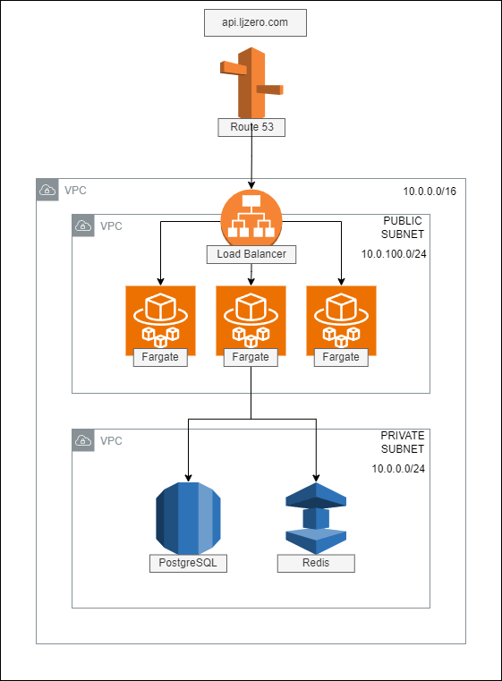

  

[circleci-image]: https://img.shields.io/circleci/build/github/nestjs/nest/master?token=abc123def456
[circleci-url]: https://circleci.com/gh/nestjs/nest

## Description

NestJS로 구현된 웹 서버 입니다

보일러플레이트로 사용 가능하도록 구현하고 있습니다

GIT ACTION을 사용하여 CI/CD를 구성합니다

인프라는 아래와 같은 형태로 구성합니다

- 현재는 프리티어 사용으로 fargate가 아닌 EC2(ASG)로 구성
- 로드밸런서에 외부 아이피 할당시 비용 발생하여 Internal로 생성 EC2 인스턴스에 부여된 PUBLIC IP로 접속 가능하도록 haproxy를 사용하여 연결
  (EC2 ---> haproxy ---> loadbalancer ---> EC2)

<a href="https://api.ljzero.com/health" target="_blank">https://api.ljzero.com/health</a>
로접속하여 상태 확인 가능
